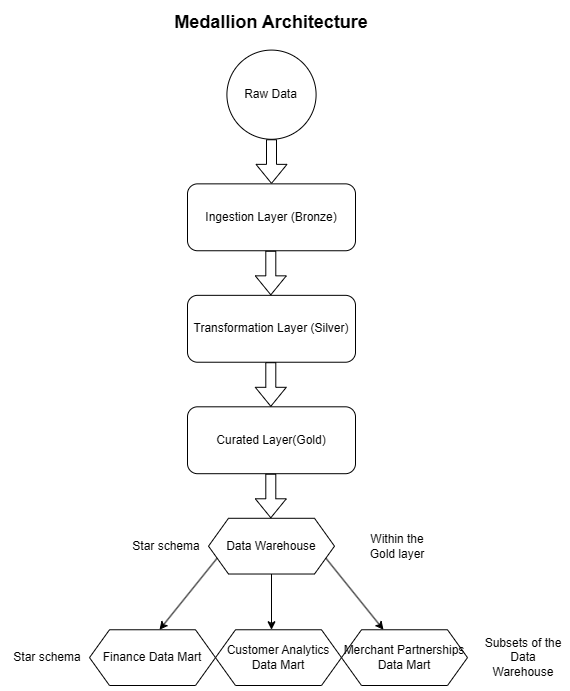
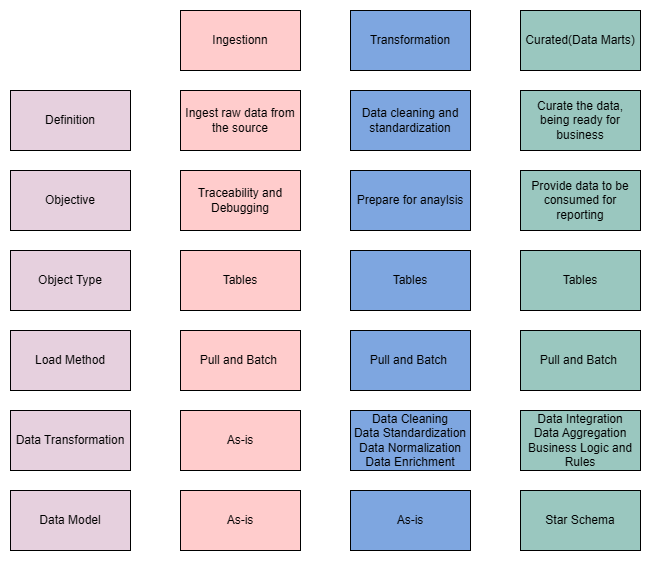

# Modern Financial Data Platform for ClearSpend
snake case naming method is used for this project
  
## The Architecture of the platform build
  
  
Thus the running order of this pipeline should be:  
ingestion_ddl > ingestion_dml > all transformation > curating > creating specific data mart for department
  
## The specific Layer design

